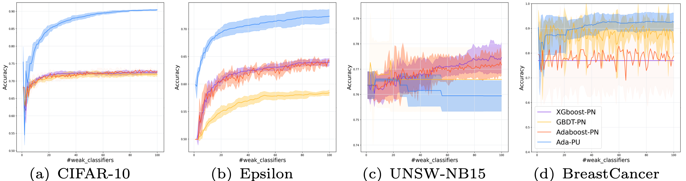
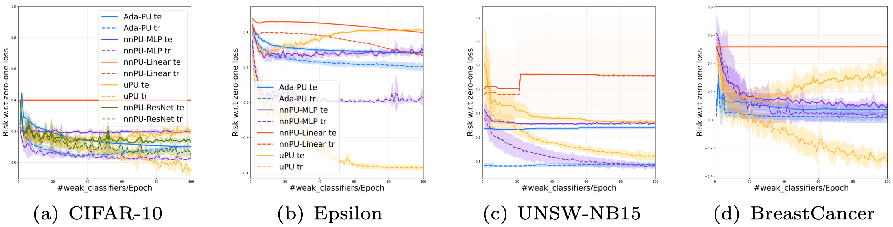

# Ada-PU: A Boosting Algorithm for Positive-Unlabeled Learning

This is a reproducing code for Ada-PU in the paper "A Boosting Algorithm for Positive-Unlabeled Learning".

* ```utils.py``` has implementations of the risk estimator for non-negative PU (nnPU) learning [1]. 
* ```train.py``` is an example code of running the algorithm. 

The four used datasets are:
* ```CIFAR-10``` [CIFAR-10](https://www.cs.toronto.edu/~kriz/cifar.html) [2] preprocessed in such a way that artifacts form the P class and living things form the N class.
* ```Epsilon``` [Epsilon](https://www.csie.ntu.edu.tw/~cjlin/libsvmtools/datasets/binary.html) is a binary classification text dataset.
* ```UNSW-NB15``` [UNSW-NB15](https://research.unsw.edu.au/projects/unsw-nb15-dataset) is a binary classification dataset.
* ```Breast Cancer``` [Breast Cancer](https://archive.ics.uci.edu/ml/datasets/Breast+Cancer+Wisconsin+(Diagnostic)) is a binary classification dataset.


## Operation System:
  

## Requirements：
     


## Quick start
You can just run the python file, it will be executed once, and the result will be printed. You can try different parameters before you execute the python file.

```
python3 /src/train.py \
--dataset breastcancer \
--seed 1 \
--num_clf 100 \
--nnpu 1 \
--beta 0.1 \
--random 1
```

## Example Results

The errors are measured by zero-one loss.
* Test accuracy of comparing with other algorithms in ```img/pn.png```



* Training error and test error of comparing with Neural Network in ```img/pu.png```



## Reproduce
| Dataset | Beta | Accuracy |
| ------------- | ------- | -------- |
| CIFAR-10      | 0.1     | 90.42 |
| Epsilon       | 0.9     | 73.10 |
| UNSW-NB15     | 0.2     | 75.94 |
| Breast Cancer | 0.00125 | 92.11 |

## Reference

[1] Ryuichi Kiryo, Gang Niu, Marthinus Christoffel du Plessis, and Masashi Sugiyama. 
"Positive-Unlabeled Learning with Non-Negative Risk Estimator." Advances in neural information processing systems. 2017.
[2] Krizhevsky, Alex, and Geoffrey Hinton. "Learning multiple layers of features from tiny images." (2009).
